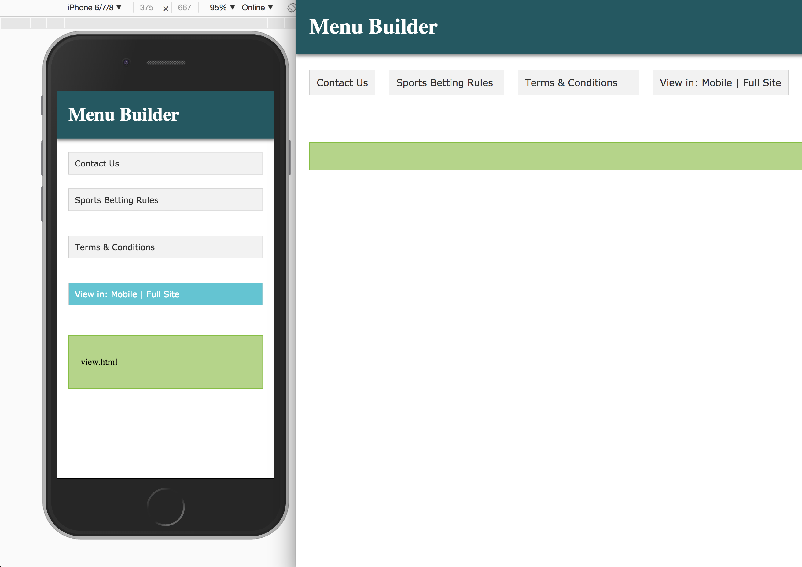
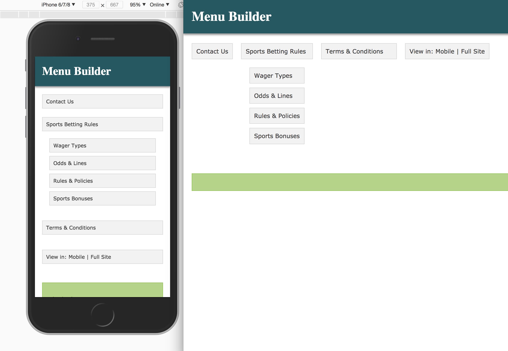
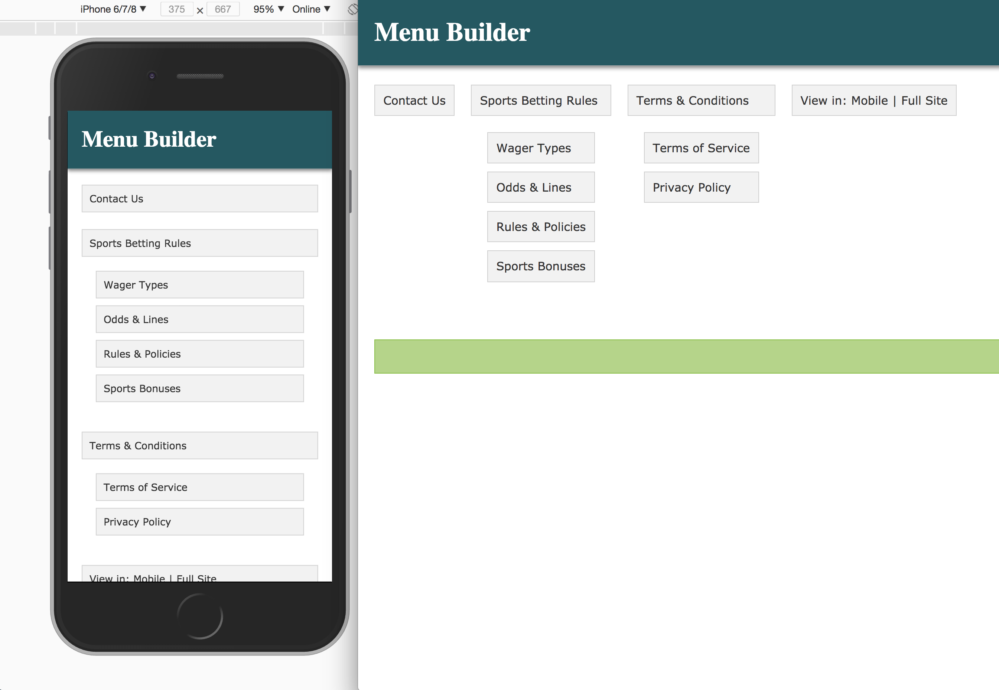

# Javascript Coding Test

---

## Setup

> You can setup the project by navigating to the folder using the terminal/command and typing npm install

```js
 npm install
```

Once that is successful type grunt in the command line

```js
grunt;
```

This will run a webserver which would allow you to access the site at [http://localhost:9001](http://localhost:9001)

## Requirements

Please find attached the file menu.json. Use it to complete the following points.
\*Create a blank web page and load this JSON with JavaScript

*   Use the loaded JSON to create a tree menu taking into consideration this JSON structure description:
*   Id: id of the element
*   Leaf: If true, this is an end-node
*   Description: Text displayed in the menu
*   Link: Not applicable
*   Content Explained later
*   CssClass: CSS class of the menu element
*   Menu: If available contains the submenu nodes
*   Include the following attributes in each menu element: id, cssClass. Also the description has to be displayed as the menu text.
*   When you click on a menu it should display any nested sub navigation, displaying the content on the page.
    Requirements
*   Use Object Oriented JavaScript for the implementation; do not use a framework for this task, it should be plain Javascript.
*   Make the code the most adaptable possible.
*   Use a Git repository to save the test and share it

## Screenshots of Menu Builder

<!--  -->

### Menu Builder: default view



### Menu Builder: one sub menu open



### Menu Builder: all sub menus open


